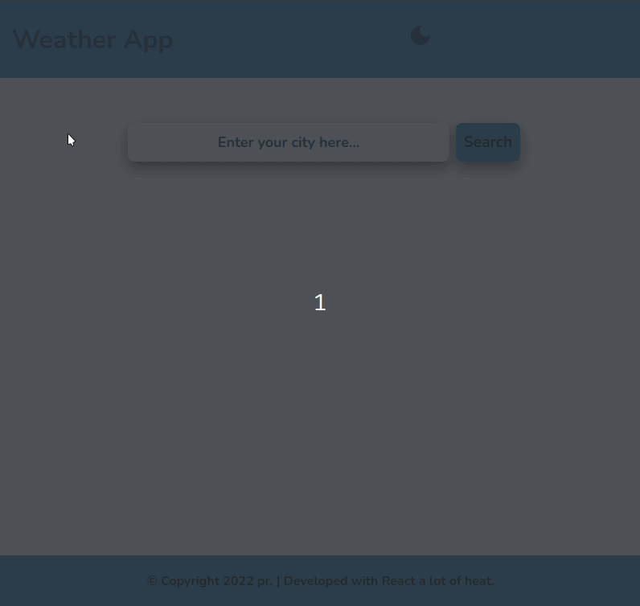

# Weather App

⛅ Weather app written in React and Typescript

## Preview

[Link da aplicação](https://prweatherapp.netlify.app/)

## Tecnologias

- [React](https://pt-br.reactjs.org/)
- [TypeScript](https://www.typescriptlang.org/)
- [Styled Components](https://styled-components.com/)
